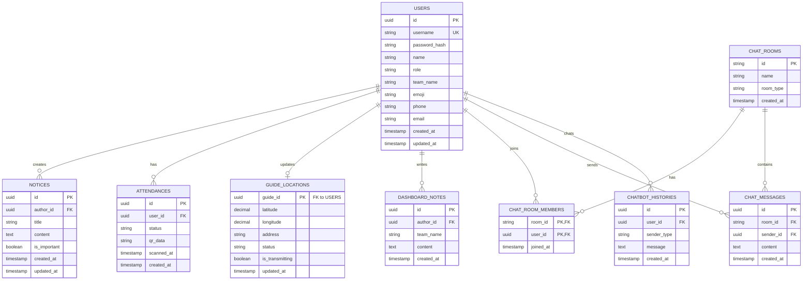

# BACKEND ERD (Entity Relationship Diagram)

## 1. 개요
본 문서는 `BACKEND_DATA_IA.md` 및 `FRONT_MOCK_PROMPT.md`에서 정의된 라우터별 데이터 요구사항을 바탕으로 작성된 관계형 데이터베이스(RDB) 스키마 설계 논리 모델입니다. 각 엔티티(테이블)의 속성, 기본키(PK), 외래키(FK)를 정의하며, 채팅방과 사용자 간의 다대다(N:M) 관계를 해소하기 위한 중간 테이블(`chat_room_members`)을 포함하여 설계되었습니다.

---

## 2. ER Diagram (Mermaid)

---

## 3. 테이블 상세 명세 (Table Specifications)

### 3.1. `users` (사용자 계정 및 프로필)
- **설명:** 시스템에 접속하는 모든 역할(참석자, 인솔자, 의전, 본부)의 기본 계정 및 프로필 데이터
- **Columns:**
  - `id` (UUID, **PK**): 사용자 고유 식별자
  - `username` (VARCHAR, **UK**): 로그인 아이디 (Unique)
  - `password_hash` (VARCHAR): 암호화된 비밀번호
  - `name` (VARCHAR): 실명 (예: John Doe, 김인솔)
  - `role` (VARCHAR): 역할 ENUM ('ATTENDEE', 'GUIDE', 'ESCORT', 'HQ')
  - `team_name` (VARCHAR): 소속 팀 (예: 'Team A', 'Team B', 'All')
  - `emoji` (VARCHAR): 역할 프로필 아이콘 아이따
  - `phone` (VARCHAR, NULL): 연락처 (프로필에서 수정 가능)
  - `email` (VARCHAR, NULL): 이메일 (프로필에서 수정 가능)
  - `created_at` (TIMESTAMP): 계정 생성일
  - `updated_at` (TIMESTAMP): 최근 수정일

### 3.2. `notices` (공지사항)
- **설명:** 본부에서 작성하는 전체/중요 공지사항 내역
- **Columns:**
  - `id` (UUID, **PK**): 공지 고유 식별자
  - `author_id` (UUID, **FK** -> `users.id`): 작성자 (본부 계정)
  - `title` (VARCHAR): 공지 제목
  - `content` (TEXT): 공지 내용 (AI 초안 포함 가능)
  - `is_important` (BOOLEAN): 필독/중요 여부 (Default: false)
  - `created_at` (TIMESTAMP): 작성일 (Date 렌더링용)
  - `updated_at` (TIMESTAMP): 수정일

### 3.3. `attendances` (출석 기록)
- **설명:** 참석자들의 QR 스캔을 통한 출석 정보
- **Columns:**
  - `id` (UUID, **PK**): 출석 기록 식별자
  - `user_id` (UUID, **FK** -> `users.id`): 인증한 참석자 ID
  - `status` (VARCHAR): 출석 상태 ('ATTENDED', 'MISSING' 등)
  - `qr_data` (VARCHAR, NULL): 스캔된 원본 QR 데이터 (보안/검증용)
  - `scanned_at` (TIMESTAMP): 출석이 스캔되어 승인된 시간
  - `created_at` (TIMESTAMP): 레코드 생성일

### 3.4. `guide_locations` (인솔자 실시간 GPS 위치)
- **설명:** 인솔자 단말기 기반의 위치 정보 (1:1 관계로 최신 상태를 덮어씌움 또는 이력 관리). 여기서는 현황판용 '최신 1건 상태 테이블'을 기준으로 설계
- **Columns:**
  - `guide_id` (UUID, **PK** 겸 **FK** -> `users.id`): 인솔자의 ID
  - `latitude` (DECIMAL): 위도 좌표
  - `longitude` (DECIMAL): 경도 좌표
  - `address` (VARCHAR): 변환된 지번/도로명 주소
  - `status` (VARCHAR): 상태 요약 ('이동 중', '대기 중' 등)
  - `is_transmitting` (BOOLEAN): 현재 GPS 토글 ON/OFF 여부
  - `updated_at` (TIMESTAMP): 마지막 신호/좌표 업데이트 시간

### 3.5. `dashboard_notes` (대시보드 특이사항 메모)
- **설명:** 의전 팀이 입력하고 본부가 모니터링하는 현장 특이사항 로그
- **Columns:**
  - `id` (UUID, **PK**): 메모 식별자
  - `author_id` (UUID, **FK** -> `users.id`): 작성한 의전 사용자 ID
  - `team_name` (VARCHAR): 해당 상황이 발생한 대상 팀명
  - `content` (TEXT): 상황 메모 내용
  - `created_at` (TIMESTAMP): 작성 시간

### 3.6. `chat_rooms` (채팅방)
- **설명:** 역할 및 팀 전용 소통을 위한 채팅방 마스터 테이블 
- **Columns:**
  - `id` (VARCHAR, **PK**): 채팅방 고유 ID (예: 'escort-all', 'staff', 'team-a')
  - `name` (VARCHAR): 화면에 표시될 그룹 이름 (예: 'Team A 채팅방')
  - `room_type` (VARCHAR): 방 성격 ('TEAM', 'ESCORT_ALL', 'STAFF_ONLY' 등)
  - `created_at` (TIMESTAMP): 채팅방 개설 시점

### 3.7. `chat_room_members` (채팅방 참여자, 中間 테이블)
- **설명:** 사용자와 채팅방 간의 M:N(다대다) 접근 권한 매핑용 중간 테이블 ("누가 어느 채팅방에 소속되어 있는가")
- **Columns:**
  - `room_id` (VARCHAR, **PK**, **FK** -> `chat_rooms.id`): 채팅방 식별자
  - `user_id` (UUID, **PK**, **FK** -> `users.id`): 사용자 식별자
  - `joined_at` (TIMESTAMP): 방에 추가된 시간

### 3.8. `chat_messages` (채팅 메시지 로깅)
- **설명:** 각 채팅방 내 사용자들이 주고받은 메시지 본문들
- **Columns:**
  - `id` (UUID, **PK**): 메시지 스레드 고유 ID
  - `room_id` (VARCHAR, **FK** -> `chat_rooms.id`): 메시지가 발송된 방
  - `sender_id` (UUID, **FK** -> `users.id`): 메시지를 발송한 사람
  - `content` (TEXT): 메시지 본문
  - `created_at` (TIMESTAMP): 발송 시간

### 3.9. `chatbot_histories` (AI 챗봇 대화 기록)
- **설명:** AI 관광/교통 챗봇과 사용자가 주고받은 질의응답 히스토리
- **Columns:**
  - `id` (UUID, **PK**): 로그 식별자
  - `user_id` (UUID, **FK** -> `users.id`): 챗봇을 이용한 사용자
  - `sender_type` (VARCHAR): 보낸 주체 구분 ('user' | 'bot')
  - `message` (TEXT): 문답 챗 내용
  - `created_at` (TIMESTAMP): 보낸/받은 시간
